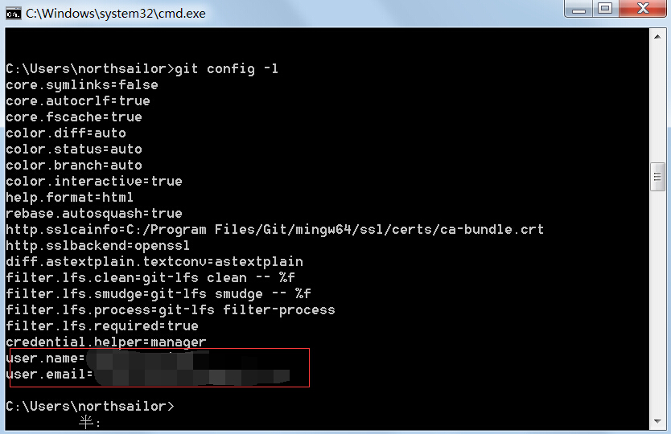

# Git快速使用
#### 本节知识点
* 单机Git工具的使用
* Git工具的主要使用流程
* Git中的工作区、暂存区、主分区
* Git实现版本的回退
* Git实现文件的修改

***
#####第一步，设置开发者的个人信息
每个系统都是由多个开发者协作完成，所以我们需要定义自己的名字和email地址，一遍进行联系及协作：
**用户名：** **git config --global user.name "你的用户名"**
**用户名：** **git config --global user.email "你的邮箱"**![]
使用命令：git config -l命令查看配置信息

